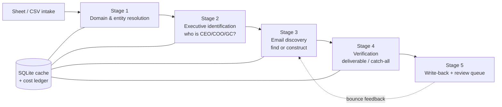

# Courtesy Email Contact Enrichment — Design Spec

**Version:** 0.2 · **Date:** 2026-08-13 · **Status:** built (M0–M3 implemented). See [docs/build-notes.md](docs/build-notes.md).

---

## 1. Problem & Goal

Schallert PC sends demand letters to defendant companies. When no timely response is received, the firm sends a **courtesy email** to executives at the defendant company. Today, finding those executives' emails is manual research (the "Contact Research" tab of the [Courtesy Email Spreadsheet](https://docs.google.com/spreadsheets/d/1mJG-_-mx6Ngf9BvtCfE19iqIKZk8ru1pEfw3tLY5Znc/)), done one company at a time.

**Goal:** a pipeline that, for each defendant company, finds the **name, title, and company email** of:

| Priority | Role | Accepted titles (waterfall within role) |
|---|---|---|
| 1 | **Legal** | General Counsel → Chief Legal Officer → Head of Legal / VP Legal → Legal Counsel → (fallback: `legal@`, `privacy@`) |
| 2 | **CEO** | CEO → Founder/Co-founder → President → Owner/Managing Member |
| 3 | **COO** | COO → VP Operations / Head of Operations |
| 4 | **CFO** *(sheet header includes it)* | CFO → VP Finance |
| 5 | **Privacy** *(sheet header includes it)* | CPO/DPO/Privacy Officer → (fallback: `privacy@`) |

When a person's email can't be found directly, the pipeline **detects the company's email naming convention** (e.g. `{first}@`, `{first}.{last}@`, `{f}{last}@`) and **constructs a guess**, then verifies deliverability. This mirrors the existing manual process — the 287 already-researched rows are pattern-guessed in exactly this way.

**Non-goals (v1):** sending emails (the MJS Launch tab / a human does that), Trello integration, revenue research beyond a basic size flag, non-US entities beyond best-effort.

## 2. Input Data (audited 2026-08-12 — see [docs/data-audit.md](docs/data-audit.md))

- 550 defendant rows with website; unique key = **Trello card URL** (also unique: defendant name).
- **287 rows already have emails** ("Ready to Send" 152 / "Pending Review" 135) — ~1,223 emails, 98% person-style. These are *training data*: they prove per-domain naming conventions and give pattern priors.
- **263-row work queue**: 260 "Pending Review" with no emails + 3 "Emails Did Not Work" (bounce feedback).
- Recurring hazards the pipeline must handle:
  - **Brand domain ≠ corporate email domain** (USRx → `axnygroup.com`; Pharmavite → `uqora.com`; Oxford Industries → `jackrogersusa.com`; Sightline → `armytimes.com`).
  - **Parent companies / acquisitions** (notes: "owned by Juneshine", "Sonder acquired in July 2026 by UpN…").
  - **No corporate email domain at all** ("Gmail addresses only") and **catch-all domains**.
  - Some notes flag **company size** ("Less than $10 Million") — worth surfacing automatically.

## 3. Architecture



Every stage is a **waterfall of providers, cheapest first**, that stops as soon as it has a confident answer. Every provider call is cached in SQLite (idempotent re-runs are free) and logged to a cost ledger with a hard per-run budget cap.

### Stage 1 — Domain & entity resolution
1. Normalize website → registrable domain (`urbanskinrx.com`).
2. **Learn from the sheet itself**: if any existing rows have emails on this or a related domain, adopt that email domain + pattern (free, highest confidence).
3. MX lookup (free): no MX → flag `no_email_domain` (the "Gmail only" case).
4. Scrape site privacy policy / terms / contact pages (free): legal entity name, parent company, corporate domain hints.
5. News check for acquisitions (Google News RSS, free).

Output: `email_domain`, `entity_name`, `parent_company?`, `is_catch_all?` (from Stage 4 probe), `size_flag?`.

### Stage 2 — Executive identification (who)
Per role, stop on first confident hit:
1. **Company site** /about /team /leadership (plain fetch → Firecrawl free tier for JS pages).
2. **SERP-confirmed LinkedIn** (Serper.dev, 2.5k free queries): `"<Company>" CEO site:linkedin.com/in` — read titles from snippets; do not scrape LinkedIn itself.
3. **Google News RSS / GDELT** (free): "appoints General Counsel/COO" announcements.
4. **Apollo People Search API** — `POST /api/v1/mixed_people/api_search`, filter by domain + title; **costs 0 credits** (only `people/match` enrichment spends them). Free plan works but the account **must be registered with a work-email domain**.
5. **Exa neural search** (long tail; ~$0.02/company, covered by free credits).
6. **SEC EDGAR full-text** (free) for the public-company minority.
7. **LLM researcher** (Claude + web search, ~$0.05/company): only for stubborn cases, with citations required.

Output per role: `person_name`, `title`, `evidence_url`, `identity_confidence`. Small companies often genuinely lack a GC/COO → record `role_absent` (a finding, not a failure) and fall back to the next role/generic address.

### Stage 3 — Email discovery
Per identified person, stop on first hit:
1. **Sheet-learned pattern** for the domain (free).
2. **Hunter Domain Search** — returns the domain's `pattern` field natively (1 credit) → apply to name.
3. **Hunter Email Finder** (name+domain, 1 credit, misses free).
4. **Anymail Finder decision-maker search** (2 credits, *charged only if verified-deliverable*) — can find "the CEO" even without a name from Stage 2.
5. **Apollo email reveal** (1 credit).
6. **Permutation engine** (free): generate candidates ordered by domain pattern → sheet-wide priors (small DTC brands skew heavily `{first}@`).

### Stage 4 — Verification
- **MillionVerifier** (primary: $39/10k credits, never expire, refunds unknowns) or **Reoon** (600 free/mo). Hunter's verifier as secondary signal.
- Result taxonomy → **confidence tier** (stored per email, shown in sheet):

| Tier | Meaning | Sendable? |
|---|---|---|
| **A `verified`** | Verifier says deliverable | Yes |
| **B `strong_guess`** | Catch-all domain, but pattern is *proven* on this domain (other verified emails match it) | Yes (current manual practice) |
| **C `weak_guess`** | Catch-all/unknown, pattern from priors only | Flag for human call |
| **D `generic_only`** | Nothing found; `privacy@`/`legal@` backstop | Yes, as backstop |
| **X `bounced`** | Reported back via "Emails Did Not Work" | Never reuse; triggers re-run |

- Guard rails: max 3 SMTP-era guesses per person, max ~8 emails per company (matches current sheet norms); never mark a catch-all guess as `verified`.

### Stage 5 — Write-back & review
- Results go to a **new "Enriched" tab** (or new columns on Contact Research) — **never overwrite** manual data or formula columns. Keyed by Trello card URL.
- Columns per company: `email_domain`, `pattern`, `pattern_confidence`, `catch_all`, `parent_company`, `size_flag`, then per role (`legal`,`ceo`,`coo`,`cfo`,`privacy`): `name`, `title`, `email`, `tier`, `source_url`; plus a **paste-ready combined Email cell** matching today's comma-separated format, `enriched_at`, `run_cost`.
- Status flow: pipeline sets `Pending Review` → human approves → `Ready to Send` (unchanged from today).
- **Bounce loop:** rows marked "Emails Did Not Work" are re-queued automatically; bounced addresses and their pattern go on a per-domain blocklist before the retry.

## 4. Google Sheet integration

The sheet is private (owner `matthew@taulersmith.com`). Two supported modes:

1. **CSV mode (M0, zero setup):** operator exports the tab → `data/input/`, pipeline writes `data/output/enriched-<date>.csv` for import/paste-back.
2. **Sheets API mode (M2):** Google Cloud **service account** + `gspread`; the sheet is shared (editor) with the service-account address; pipeline reads Contact Research and writes the Enriched tab directly. Requires a one-time setup by whoever administers the sheet.

## 5. Tech stack & repo layout

Python 3.12+ managed with `uv`; `httpx` (+ `tenacity` retries) for all API calls; `pydantic` v2 models; `sqlite3` store; `typer` + `rich` CLI; `gspread` (mode 2); `pytest` + `respx` fixtures; secrets in `.env` (never committed).

```
courtesy-email-project/
├── SPEC.md / README.md / docs/
├── data/input/ · data/output/ · data/cache.sqlite   (gitignored except inputs)
├── config.yaml            # role priorities, provider order, budgets, thresholds
├── .env.example           # all API keys, sheet ID
├── src/enrich/
│   ├── cli.py             # enrich pull|plan|run|verify|push|report
│   ├── models.py          # Company, Person, EmailCandidate, Verification, RunLedger
│   ├── store.py           # SQLite: companies, people, email_candidates, provider_calls, runs
│   ├── sheet_io.py        # CSV + gspread adapters
│   ├── pipeline.py        # stage orchestration + waterfall engine + budget guard
│   ├── patterns.py        # pattern detect/apply/permutations + sheet-learning
│   └── providers/         # one module per provider behind a common interface
│       ├── base.py        # ProviderResult, cost accounting, caching decorator
│       ├── sitescrape.py · serp.py · newsrss.py · edgar.py      (free)
│       ├── hunter.py · apollo.py · anymail.py · exa.py          (paid/credit)
│       └── verify_millionverifier.py · verify_reoon.py
└── tests/  (unit + recorded-fixture integration + back-test harness)
```

**MCP vs. direct API.** Four providers publish official MCP servers (Apollo `mcp.apollo.io/mcp`, Hunter `mcp.hunter.io/mcp`, Exa `mcp.exa.ai/mcp`, Firecrawl `mcp.firecrawl.dev/v2/mcp` — verified 2026-08-13; see [docs/signup-checklist.md](docs/signup-checklist.md)). Policy: **the batch pipeline calls REST directly** (deterministic, retryable, cost-metered, testable with recorded fixtures), while **MCP is connected for interactive/ad-hoc work** — an operator or Claude session investigating a stubborn company without writing code. Same credit pool either way, no extra cost. Apollo MCP is OAuth-only and its rate limits are unpublished, which is a second reason not to put it in the batch path.

**Provider interface** (sketch):

```python
class Provider(Protocol):
    name: str
    def find_person(self, company: Company, role: Role) -> list[PersonResult]: ...
    def find_email(self, person: Person, domain: str) -> list[EmailResult]: ...
    def cost_estimate(self, op: str) -> Money: ...
```

Waterfalls are **config, not code** (`config.yaml`):

```yaml
budget:
  per_run_usd: 10.00        # hard stop
  per_company_credits: {hunter: 4, apollo: 3, anymail: 2}
stages:
  identify: [sheet_learned, sitescrape, serp_linkedin, newsrss, apollo_search, exa, edgar, llm_researcher]
  email:    [sheet_pattern, hunter_domain, hunter_finder, anymail_decision_maker, apollo_reveal, permutation]
  verify:   [millionverifier, reoon]
roles: {legal: 1, ceo: 2, coo: 3, cfo: 4, privacy: 5}
send_tiers_auto: [A, B, D]   # C requires human approval
```

## 6. Services & cost (full comparison: [docs/service-research.md](docs/service-research.md))

**Recommended stack** (pricing verified 2026-08-12):

| Layer | Service | Cost |
|---|---|---|
| Identify (who) | Site scrape + Serper (2.5k free) + Apollo Free search + Google News RSS | $0 |
| Pattern + find | **Hunter Starter** (2,000 credits/mo; native `pattern` field) | $49 for month 1; free 50/mo tier after if volume allows |
| Find (fallback) | **Anymail Finder** (pay only for verified) | $29–49/mo only in heavy months |
| Long tail | **Exa** search+contents (~$8 for whole backlog) | $0 (inside $20 signup + $10/mo free credits) |
| Verify | **MillionVerifier** 10k pack (never expires) | ~$39 one-time |
| Optional LLM researcher | Claude web search ($10/1k searches) | ~$13–40 for backlog |

- **Backlog (263 companies, ~800 person-lookups): ≈ $90–130 one-time.**
- **Steady state (~50–150 companies/mo): $0–49/mo** (free tiers may suffice at the low end; Hunter Starter month-to-month when needed).
- **Free-only mode: $0** — expect strong CEO coverage, weak GC/COO coverage, and ~6+ months to clear the backlog on free-tier rate limits. Supported via `--free-only` flag but not recommended as the plan.
- Alternatives considered and deferred: Apollo Basic $49/mo (strong all-rounder; add if Hunter+Anymail hit-rate disappoints), Exa Websets managed run (~$49), Clay ($185/mo — orchestration overhead we're building ourselves), RocketReach/Lusha/ContactOut (weaker fit or sales-gated APIs), ZoomInfo (~$15k/yr — skip), Snov.io (no free API), PDL ($98/mo Pro — emails obfuscated on free; pay-more-for-less here).

## 7. Quality: the back-test gate

Before spending on the backlog, the pipeline must prove itself against the **287 rows with known emails**:

1. Hold out the known emails; run identify+email stages on a 50-row sample.
2. **Acceptance:** ≥70% of rows reproduce at least 3 known addresses (or their exact pattern); 0 addresses invented on domains where the pattern disagrees with the known one.
3. Report precision per provider — this tunes the waterfall order with real data before real spend.

## 8. Compliance & safety notes

- **Data handled is B2B**: names, titles, work emails of company officers — CCPA business-contact carve-outs apply; still, store only what the sheet needs.
- **Courtesy emails relate to pending legal claims** (attorney communication, not marketing), but keep CAN-SPAM hygiene anyway: accurate sender identity, firm contact info.
- **Provider ToS**: LinkedIn is never scraped directly (SERP snippets only); SMTP probing kept minimal (verifier APIs do it properly); per-site robots.txt respected for scraping; all paid data via licensed APIs.
- **No sending in scope**: pipeline output ends at "Pending Review".
- Secrets in `.env`/service-account file, gitignored; SQLite cache stays local.

## 9. Build plan

| Milestone | Deliverable | Effort |
|---|---|---|
| **M0** | Repo + models + SQLite + CSV in/out + `enrich pull/plan/report` (no providers) | small |
| **M1** | Free stack: domain resolution, sheet-pattern learning, site scrape, SERP identify, permutation + Reoon/MillionVerifier verify, **back-test harness + gate** | medium |
| **M2** | Paid waterfall: Hunter, Anymail, Apollo adapters, budget guard, Sheets API write-back; **clear the 263-row backlog** | medium |
| **M3** | Exa long-tail + Claude researcher, bounce feedback loop, per-domain blocklists | small |
| **M4** | Polish: `enrich report` dashboards, scheduled weekly run, operator docs | small |

## 10. Decisions needed before M2 (defaults proposed)

1. **Budget:** approve ~$90–130 one-time for the backlog (Hunter month 1 + MillionVerifier pack)? *Default: yes, with $150 cap.*
2. **Sheet access:** create a Google service account and share the sheet with it (M2), or stay CSV-mode? *Default: CSV through M1, service account at M2.*
3. **Role set:** Legal/CEO/COO confirmed; keep CFO + Privacy from the sheet header too? *Default: yes, all five.*
4. **Tier C policy:** send weak guesses on catch-all domains, or hold for review? *Default: hold for review (matches "Pending Review" flow).*
